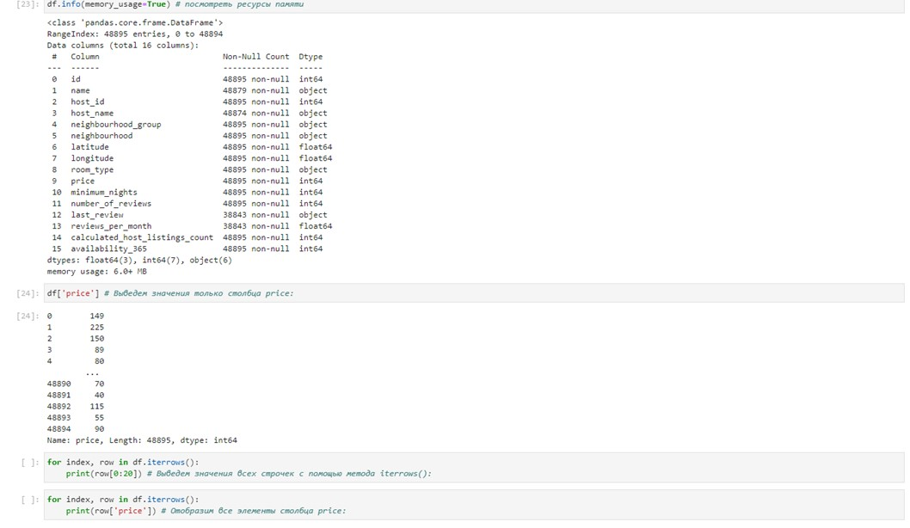

# HW2

## Задание:

1. Поднять кластер локально с помощью контейнеров в Docker (делали на семинаре).
2. Загрузите датасет по ценам на жилье Airbnb, доступный на kaggle.com: https://www.kaggle.com/dgomonov/new-york-cityairbnb-open-data
3. Используя Python, реализуйте скрипт mapper.py и reducer.py для расчета, и с помощью MapReduce рассчитайте среднее значение и дисперсию по признаку ’price’ (возможно потребуются ассимптотические формулы для дисперсии);
4. Подсчитайте среднее значение и дисперсию по признаку ”price” в hive;
5. Проверьте правильность подсчета статистики методом mapreduce
   в сравнении со hive.
6. Запуск кластера в докере:

_1) Запуск кластера в докере:_

_2) Используя JupyterLab (python) с помощью MapReduce, найдем среднее значение, дисперсию и стандартное отклонение по столбцу ’price’ из датасета new-york-cityairbnb-open-data_

_3) Используя Hue, как веб-интерфейс для Hive, найдем среднее значение, дисперсию и стандартное отклонение по столбцу ’price’ (загрузим таблицу данных вручную):_

`` > SELECT AVG(`price`) FROM `hue\_\_tmp_ab_nyc_2019`; ``

145.11843585681154

`> SELECT  VARIANCE(price) as varian_ce FROM hue__tmp_ab_nyc_2019;`

58528.66531440938

`> SELECT STD(price) as st_d FROM hue__tmp_ab_nyc_2019;`

241.9269834359313

_4) Используя Hive (консольный вариант), найдем среднее значение, дисперсию и стандартное отклонение по столбцу ’price’:_

`root@hive_server:/opt# exit`

PS E:\learning\seminar22_Big_data\S2_02.02.24\docker\apchsprk\hdfs>` docker exec -it hive-server beeline -u ‘jdbc:hive2://localhost:10000/’`

0: jdbc:hive2://localhost:10000/>`create table AB_NYC(id int, name string, host_id int, host_name string, neighbourhood_group string, neighbourhood string, latitude float, longitude float, room_type string,  price int, minimum_nights int, number_of_reviews int, last_review date, reviews_per_month float, calculated_host_listings_count int, availability_365 int) row format delimited fields terminated by ‘,’ stored as textfile;`

0: jdbc:hive2://localhost:10000/>`select * from ab_nyc limit 10;`

0: jdbc:hive2://localhost:10000/>`load data inpath ‘/AB_NYC_2019.csv’ into table ab_nyc;`

0: jdbc:hive2://localhost:10000/>`select * from ab_nyc limit 10;`

_4.1) Найдем:
• среднее значение в столбце в SQL с использованием функции AVG;
• стандартную дисперсию выражения c применением функции VARIANCE (возвращает NULL, если в заданном выражении не найдено подходящих строк) (https://www.mysqltutorial.org/mysql-aggregate-functions/mysql-variance/);
• стандартное отклонение генеральной совокупности c исп. функции STD (возвращает значение NULL, если нет соответствующей строки (https://www.mysqltutorial.org/mysql-aggregate-functions/mysql-standard-deviation/):_

0: jdbc:hive2://localhost:10000/>`select avg(ab_nyc.price) as avg_price, variance(ab_nyc.price) as dispers_price, std(ab_nyc.price) as std_price from ab_nyc;`

_5) Сравнение полученных результатов:_

Hive под капотом скрывает реализацию map\reduce (является движком исполнения план-запроса через MapReduce). Предполагаю, что правильно считать результаты c использованием функций более точными. Интересно, использование Impala, какие даст сравнительные результаты…

#### Разница между MapReduce и Hive

MapReduce — это модель, которая работает на Hadoop для эффективного доступа к большим данным, хранящимся в HDFS (распределённой файловой системе Hadoop). Это основной компонент Hadoop, который делит большие данные на небольшие фрагменты и обрабатывает их параллельно.

Hive — это инициатива, запущенная Facebook для предоставления традиционного интерфейса хранилища данных для программирования MapReduce. Для написания запросов MapReduce в стиле SQL компилятор Hive преобразует их в фоновом режиме для выполнения в кластере Hadoop. Это помогает программистам использовать свои знания SQL, а не сосредотачиваться на разработке нового языка.

